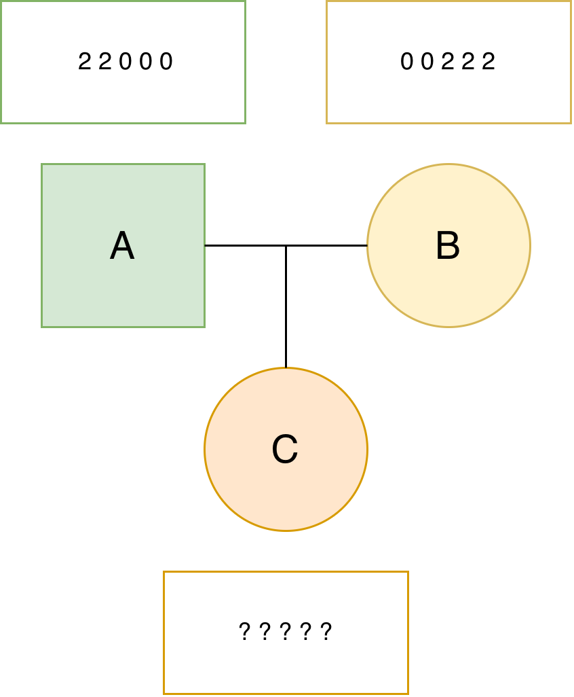

===============
Getting Started
===============

Install |Software|
------------------

Here is a sample guide for installing AlphaPeel as a Python package.

For more information on installing Python packages,
visit `Python Packaging User Guide <https://packaging.python.org/en/latest/tutorials/installing-packages/>`_.

Install via pip
===============

|Software| is available on `PyPI <https://pypi.org/project/AlphaPeel>`_
hence you can install it simply by running the following command in a terminal:

.. code-block:: bash

    pip install AlphaPeel

.. _dist-install:

Install from the git repository
===============================

You can also install |Software| from the code in git repository.

Clone the repository:

.. code-block:: bash

    git clone --recurse-submodules https://github.com/AlphaGenes/AlphaPeel.git

Change the working directory to the one holding the repository:

.. code-block:: bash

    cd AlphaPeel

Create a virtual environment:

.. code-block:: bash

    python -m venv AlphaPeel_env

Activate the environment:

    - If you are using macOS/Linux:

        .. code-block:: bash

            source AlphaPeel_env/bin/activate

    - If you are using Windows:

        .. code-block:: console

            AlphaPeel-env\Scripts\activate

Upgrade pip:

.. code-block:: bash

    python -m pip install --upgrade pip

Upgrade the build:

.. code-block:: bash

    python -m pip install --upgrade build

Build the distributions:

.. note::

    If you are building on a branch other than the main branch,
    you may need to first check if the submodule reference is correct before the build.

.. code-block:: bash

    python -m build

Install the package by using the built wheel distribution:

.. code-block:: bash

    python -m pip install dist/alphapeel*.whl

.. _run-examples:

Run examples
============

Change the working directory to the one holding the example:

.. code-block:: bash

    cd example

Run the example:

.. code-block:: bash

    bash run_examples.sh

If you have installed R, you can check the accuracy of the example code:

.. code-block:: bash

    Rscript check_accuracy.R

Deactivate the environment:

.. code-block:: bash

    deactivate

Install on Eddie
================

.. note::

    This section is only for the users from the University of Edinburgh.

To use AlphaPeel on the Eddie, the University of Edinburgh's Research Compute Cluster,
you can find information to create an environment without causing the home directory to go over quota at
`Eddie wiki page <https://www.wiki.ed.ac.uk/spaces/ResearchServices/pages/294388305/Anaconda>`_.

If you encountered the issue that the files show as modified directly after a git clone,
you may can try:

.. code-block:: bash

    git config core.fileMode false

An example
----------

The following is a very simple example to demonstrate
the principle of estimating unknown haplotypes and genotypes.
The example is deliberately simplistic for the demonstration.
Note that |Software| can handle much more complex examples.
The example contains two parents with known genotypes and
one progeny with unknown genotypes.
See the description on
:ref:`terminology and encoding of the input data and outputs <zero_one_two_etc>`.

Our task is to estimate the haplotypes of all the individuals (we name this task "phasing") and
genotypes of the progeny (we name this task "imputation").
Since the two parents are fully homozygous and the progeny has no information,
you can easily solve this problem yourself and check your solution with |Software|.

We first prepare a genotype input file:

.. code-block::

    A 2 2 0 0 0
    B 0 0 2 2 2
    C 9 9 9 9 9

And a pedigree file:

.. code-block::

    A 0 0
    B 0 0
    C A B

We named the two file as ``simple_genotype.txt`` and ``simple_pedigree.txt``.
You can create the files yourself.
They are also available in the ``example/simple_example/`` directory of the repository.
To use these files you have to change the working directory to the one holding the simple example:

.. code-block:: bash

    cd simple_example

We perform the phasing and imputation with the following command:

.. code-block:: bash

    AlphaPeel \
            -geno_file simple_genotype.txt \
            -ped_file simple_pedigree.txt \
            -method single \
            -geno -hap -out_file simple_output

Above we provided the two input files, asked for the single-locus method, and
requested the output of called genotypes and haplotypes,
with all the output filenames starting with ``simple_output``.

If the run was successful,
you should see the following output:

.. code-block:: bash

    Reading in AlphaGenes format: simple_genotype.txt
    Generating seg estimates
    Cycle  0
    Peeling Down, Generation 0
    Peeling Down, Generation 1
    Peeling Up, Generation 1
    Peeling Up, Generation 0
    Cycle  1
    Peeling Down, Generation 0
    Peeling Down, Generation 1
    Peeling Up, Generation 1
    Peeling Up, Generation 0
    Cycle  2
    Peeling Down, Generation 0
    Peeling Down, Generation 1
    Peeling Up, Generation 1
    Peeling Up, Generation 0
    Cycle  3
    Peeling Down, Generation 0
    Peeling Down, Generation 1
    Peeling Up, Generation 1
    Peeling Up, Generation 0
    Cycle  4
    Peeling Down, Generation 0
    Peeling Down, Generation 1
    Peeling Up, Generation 1
    Peeling Up, Generation 0

And following output files:

.. code-block:: bash

    simple_output.dosage.txt
    simple_output.rec_prob.txt
TODO: Let's round up these thresholds to 0.3333333333333333 to 0.33, so 2 digits
      This should be enough, I reckon, but happy to discuss!
    simple_output.geno_0.3333333333333333.txt
    simple_output.seq_error_prob.txt
    simple_output.geno_error_prob.txt
    simple_output.hap_0.5.txt

The ``simple_output.hap_0.5.txt`` provides the called haplotypes:

.. code-block:: bash

    A 1 1 0 0 0
    A 1 1 0 0 0
    B 0 0 1 1 1
    B 0 0 1 1 1
    C 1 1 0 0 0
    C 0 0 1 1 1

As you can see, each of the parents has two identical haplotypes,
in line with their fully homozygous genotypes.
As such, the progeny could only inherit one kind of a haplotype
from each of the parents, making this a very simple example.

TODO: Let's round up these thresholds to 0.3333333333333333 to 0.33, so 2 digits
      This should be enough, I reckon, but happy to discuss!
The ``simple_output.geno_0.3333333333333333.txt`` provides the called genotypes:

.. code-block:: bash

    A 2 2 0 0 0
    B 0 0 2 2 2
    C 1 1 1 1 1

Which are just the sum of the haplotype alleles of each individual.

For more information about how to use |Software|, please see :ref:`usage`.
